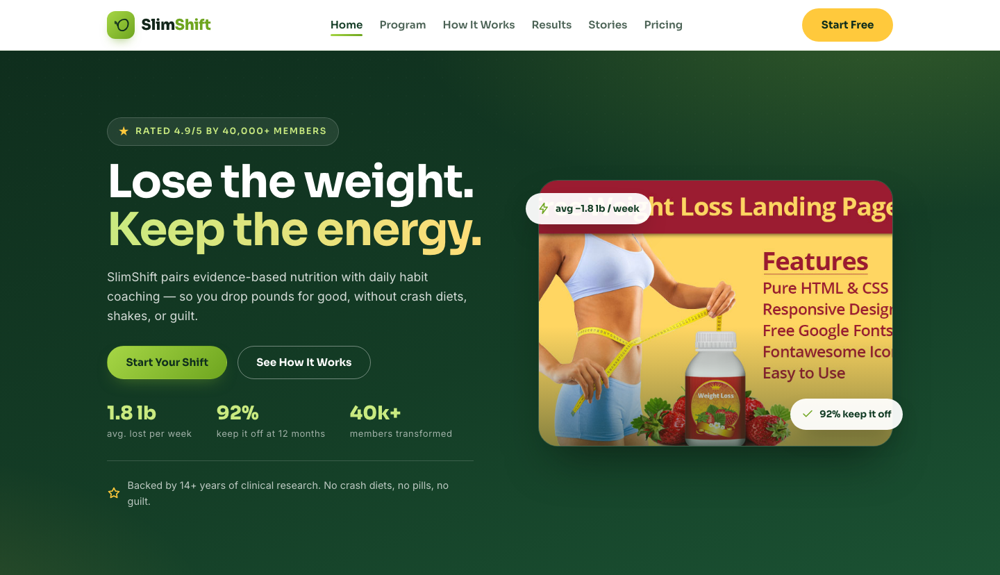

# SlimShift — Science-Backed Weight Loss & Healthy Lifestyle Program

A premium, fully responsive one-page landing template for a weight-loss and healthy-lifestyle program. The design leans into vibrant leaf greens and energising citrus, with bold rounded type and confident stats — a fresh, motivating home for a program that promises real shifts.

## 📸 Screenshot

## Design System

| Token | Value |
|-------|-------|
| **Primary palette** | `--leaf-700` `#1b5233`, `--leaf-900` `#0f2e1d`, `--ink` `#13271b` |
| **Accent** | `--lime-500` `#86be2f`, `--lime-400` `#a6d645`, `--citrus-400` `#ffc93c` |
| **Neutrals** | `--mint-100` `#f1f8ed`, `--mint-50` `#f9fcf6`, `--ink-soft` `#4c6356` |
| **Display type** | `Sora` (sans, geometric) |
| **Body type** | `Inter` (sans, 400–500) |
| **Container** | 1180px max-width, centered |
| **Breakpoints** | ~980px (tablet), ~720px (mobile) |

## Page

| Section | Location | Description |
|---------|----------|-------------|
| Single-page site | [index.html](index.html) | Hero, program benefits, three-shift method, results stats, testimonials, signup form, footer |

## Features

- **Framework-free** — pure HTML5, CSS3 (custom properties, Grid, Flexbox, `clamp()`), vanilla JavaScript
- **Fresh-energy aesthetic** — leaf greens with citrus accents and geometric Sora display type
- **Fluid responsive** — 3 breakpoints, no horizontal scroll on any viewport
- **Scroll reveal** — IntersectionObserver-powered `.reveal` animations (respects `prefers-reduced-motion`)
- **Mobile nav** — burger toggle with `aria-expanded` accessible pattern
- **Hero crossfade** — automatic 6s image transition via `.hero-bg img` + `.active` class
- **Form validation** — `[data-form]` hook with `.form-ok` / `.form-err` / `.show` toggle
- **Glyph icons** — custom inline SVG icons in markup, no icon library dependency
- **Original imagery** — production-quality health photography, no placeholders

## Tech Stack

- HTML5 + CSS3 (W3C-valid, semantic landmarks)
- Vanilla JavaScript (76-line IIFE, unmodified canonical build)
- Google Fonts (Sora + Inter)
- SVG favicon (inline data: URI)

## SEO

- Semantic HTML5 structure (`<header>`, `<nav>`, `<main>`, `<section>`, `<footer>`)
- Unique `<title>` and `<meta description>`
- `lang="en"` attribute, `charset="utf-8"`, viewport meta
- Alt text on all images
- Open Graph / Twitter Card meta tags

## License

Free for personal and commercial use. Attribution appreciated but not required.

---

## Let's Build Something Together 🚀

[Book a free consultation](https://tally.so/r/q4q1L9)
